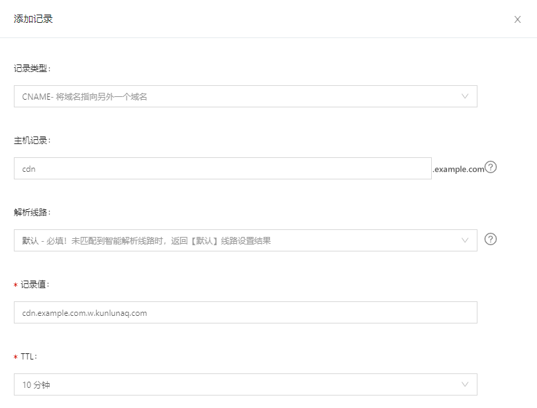

<!--The source of the doc is at https://github.com/damingsoft/pt.miscellaneous/使用阿里云CDN服务和自有源站搭建DBRJS私有CDN/-->

# 关于国内用户如何访问稳定CDN以加速Dynamsoft Barcode Reader JS库的解决方案

​    在Web开发中使用Dynamsoft Barcode Reader（DBR）的JS库时，通常有两种方式：

一、访问jsdelivr或UNPKG等免费静态资源服务器，载入js及wasm资源。

​        问题1：国外的免费CDN服务会偶发性无法连接到服务器，导致网站核心功能失效。

二、访问本地web服务器，获取静态资源。

​        问题2：本地web服务器带宽压力大，下载缓慢，如下图所示，影响网站用户体验。

​    因此为同时解决以上两个问题，可将资源文件剥离出Web服务器，使用CDN加速的方式进行访问，不仅能够极大的减轻服务器带宽的经济压力，也可以大幅提升单节点Web服务器的页面浏览承载能力，提升用户体验。

​    本文将结合阿里云CDN服务和自有源站，提供操作示例。当然，使用其他厂商CDN服务的操作过程，也是大同小异。

目录

[准备工作](#准备工作)

​    [基本概念须知](#基本概念须知)

[一.添加加速域名](#一.添加加速域名)

​    [步骤一：配置基础信息和业务信息](#步骤一：配置基础信息和业务信息)

​    [步骤二：配置源站](#步骤二：配置源站)

​    [步骤三：完成域名审核](#步骤三：完成域名审核)

[二.配置CNAME](#二.配置CNAME)

​    [步骤一：复制加速域名对应的CNAME记录值](#步骤一：复制加速域名对应的CNAME记录值)

​    [步骤二：添加CNAME记录](#步骤二：添加CNAME记录)

​    [步骤三：验证CNAME配置是否生效](#步骤三：验证CNAME配置是否生效)

​    [步骤四：验证CDN是否生效](#步骤四：验证CDN是否生效)

[三.配置HTTPS证书](#三.配置HTTPS证书)

​    [步骤一：配置或更新HTTPS证书](#步骤一：配置或更新HTTPS证书)

​    [步骤二：验证HTTPS配置是否生效](#步骤二：验证HTTPS配置是否生效)

[四.配置跨域资源共享](#四.配置跨域资源共享)

[五.配置缓存](#五.配置缓存)

[六.使用JS库](#六.使用JS库)

## 准备工作

1.准备一个顶级域名，本例准备的顶级域名为`example.com`。

2.准备一个配置好域名和HTTPS的自有站点，本例继续使用`example.com`作为该站点域名。

3.部署Dynamsoft Barcode Reader js库到自有站点。本例使用该库的9.0.2版本。

​    下载方式可以是以下三种：

1. `npm i dynamsoft-javascript-barcode`
2. `git clone --depth 1 https://github.com/Dynamsoft/barcode-reader-javascript.git`
3. 前往`https://github.com/Dynamsoft/barcode-reader-javascript.git`下载ZIP包

​    本例将其中的资源文件夹`dist`部署于`https://example.com/dynamsoft-barcode-reader9.0.2/dist`。较老的Web服务器可能还需配置`.wasm`的`MIME type`, 请更新Web服务器软件，或参考文档[Hosting the Library - Configure the Server](https://www.dynamsoft.com/barcode-reader/programming/javascript/user-guide/advanced-usage.html?ver=latest&utm_source=guide&product=dbr&package=js#step-two-configure-the-server)配置。

4.注册阿里云账号并完成实名认证。

5.开通CDN服务

1. 进入[阿里云CDN平台](https://www.aliyun.com/product/cdn)；
2. 单击**立即开通**；
3. **计费类型**默认按使用流量计费，并选中**服务协议**。CDN产品定价，请参见[CDN定价](https://www.aliyun.com/price/product?spm=a2c4g.11186623.2.10.1b444ee22Dxy8y#/cdn/detail)；
4. 单击**立即开通**。成功开通CDN服务后，即可单击**管理控制台**，进入CDN管理控制台界面。

### 基本概念须知

**源站**

源站，指您运行业务的网站服务器，是加速分发数据的来源。

源站可用来处理和响应用户请求，当边缘节点没有缓存用户请求的内容时，节点会返回源站获取资源数据并返回给用户。阿里云CDN的源站可以是对象存储OSS、函数计算、自有源站（IP、源站域名）。

**加速域名**

加速域名，是您接入CDN用于加速、终端用户实际访问的域名。

阿里云CDN通过加速域名，将源站资源缓存到CDN加速节点，实现资源访问加速。在阿里云CDN的帮助文档中，加速域名通常被简写为域名。

**CNAME记录/CNAME域名**

CNAME（Canonical Name）记录，指域名解析中的别名记录，用来把一个域名解析到另一个域名（CNAME域名），再由CNAME域名来解析到需要访问的服务器IP地址。

CNAME域名，是CDN生成的，当您在阿里云CDN控制台添加加速域名后，系统会为加速域名分配一个`*.*kunlun*.com`形式的CNAME域名。

> 概念摘自https://help.aliyun.com/document_detail/27102.html?spm=5176.11785003.help.dexternal.289d142fuMcLvK*

## 一.添加加速域名

#### **步骤一：配置基础信息和业务信息**

1. 进入[CDN控制台](https://cdn.console.aliyun.com/)。
2. 在左侧导航栏，单击**域名管理**。
3. 单击**添加域名**，完成基础信息和业务信息配置。本例使用`cdn.example.com`作为加速域名。若是首次添加域名，需要按照提示验证域名归属权。

#### **步骤二：配置源站**

1. 完成基础信息和业务信息配置后，单击**新增源站信息**。
2. 在**新增源站信息**页面，完成以下配置。

​        源站信息：选择源站域名，并填入自有站点的域名，本例填写`example.com`；

​        优先级、权重、端口请根据具体需求修改，本例中均选择默认。

#### **步骤三：完成域名审核**

1. 完成源站配置后，单击**下一步**。
2. 等待人工审核。

## 二.配置CNAME

成功添加加速域名后，CDN会分配一个CNAME域名。需要在域名解析服务商处将加速域名的DNS解析记录指向CNAME域名，访问请求才能转发到CDN节点上，实现CDN加速。

**注意**

​    若域名不在阿里云注册，请前往对应的域名注册商完成DNS配置。

由于本例中使用的是在阿里云注册的域名，故以下操作步骤仅供参考：

#### 步骤一：复制加速域名对应的CNAME记录值

前往阿里云CDN控制台的域名管理列表，复制加速域名对应的CNAME记录值。本例为`cdn.example.com.w.kunlunaq.com`

#### 步骤二：添加CNAME记录

1. 使用**加速域名所在的阿里云账号**，前往[云解析DNS控制台](https://dns.console.aliyun.com/?spm=a2c4g.11186623.0.0.4a366cb5wmnOVw)。

2. 在**域名解析**页面，找到`example.com`域名，在域名右侧单击**解析设置**。

3. 单击**添加记录**，添加CNAME记录。
   
   记录类型：选择CNAME；
   
   主机记录：填写上一步自定义的加速域名`cdn`；
   
   记录值：粘贴步骤一复制好的CNAME记录值；
   
   解析路线和TTL可根据需求填写，本例均选择默认值。
   
   

4. 单击**确认**，完成添加。
   
   云解析DNS上新增CNAME记录实时生效，修改CNAME记录在10分钟后生效（具体生效时间长短取决于域名DNS解析配置的TTL时长，10分钟为TTL的默认时长），在这期间内CDN控制台的域名列表中可能仍显示“未配置CNAME”，请先忽略。

#### 步骤三：验证CNAME配置是否生效

1. 前往阿里云CDN控制台的**域名管理列表**。
2. 选择目标域名，查看加速域名的CNAME状态是否为“已配置”。

#### 步骤四：验证CDN是否生效

在浏览器中访问`http://cdn.example.com/dynamsoft-barcode-reader9.0.2/dist/dbr.js`，若页面如下图所示，则表示CDN配置成功。

如果出现404提示，可能需要进行回源Host配置，参照阿里云文档[配置回源HOST](https://help.aliyun.com/document_detail/27131.html)

## 三.配置HTTPS证书

CDN支持HTTPS加速服务，可以上传自定义证书或将已经托管在阿里云SSL证书服务的证书部署至CDN平台，启用HTTPS加速服务，实现全网数据加密传输。

### 步骤一：配置或更新HTTPS证书

**注意：**HTTPS功能为增值服务，开启HTTPS将产生HTTPS请求数计费，该费用单独按量计费，不包含在CDN流量包内。

1. 进入CDN控制台。

2. 在左侧导航栏，单击**域名管理**。

3. 在**域名管理**页面，单击目标域名对应的**管理**。

4. 在指定域名的左侧导航栏，单击**HTTPS配置**。

5. 在**HTTPS证书**区域，单击**修改配置**。

6. 在**HTTPS设置**界面，打开**HTTPS安全加速**开关。
   
   当打开**HTTPS安全加速**开关时，系统弹出确认开启HTTPS界面，该操作单独计费，可以根据所需选择是否开启。

7. 配置证书相关参数。
   
   **注意：**本例中的证书使用的是在阿里云申请的免费证书，用户也可根据自身情况选择自定义上传。

### 步骤二：验证HTTPS配置是否生效

更新HTTPS证书1分钟后将全网生效。可使用HTTPS方式访问资源，如果浏览器中出现锁的HTTPS标识，表示HTTPS安全加速已生效。如下图所示：

## 四.配置跨域资源共享

跨域资源共享CORS（Cross-Origin Resource Sharing）简称跨域访问，是HTML5提供的标准跨域解决方案，允许Web应用服务器进行跨域访问控制，使得跨域数据传输得以安全进行。

1. 进入CDN控制台。

2. 在左侧导航栏，单击**域名管理**。

3. 在**域名管理**页面，单击目标域名对应的**管理**。

4. 在指定域名的左侧导航栏，单击**缓存配置**。

5. 单击**自定义HTTP响应头**页签。

6. 单击**添加**，配置自定义HTTP响应头。

7. 选择**增加**并设置**自定义响应头参数**为`Access-Control-Allow-Origin`。
   
   响应头值：可根据自身情况进行填写，本例中直接填写*。

> 参数说明详见https://help.aliyun.com/document_detail/283310.html?spm=5176.11785003.help.dexternal.350d142fuP53Ef#task-2100263

## 五.配置缓存

缓存过期时间指源站资源在CDN节点缓存的时长，达到预设时间，资源将会被CDN节点标记为失效资源。如果客户端向CDN节点请求的资源已经失效，CDN会去源站获取最新资源并缓存到CDN节点。

1. 与上一步骤相同页面内，在**缓存过期时间**页签下，单击**添加**。

2. 在**添加缓存过期时间**对话框，配置缓存规则。
   
   类型：选择**目录**；
   
   地址：填写在自有站点上存放JS库的路径，本例即`/dynamsoft-barcode-reader9.0.2/dist`；
   
   过期时间：由于Dynamsoft Barcode Reader JS库以版本号的方式同步，即更新源站内容时采用不同的名称，因此过期时间可以设置尽可能长，这里设为1年。

> 参数说明详见https://help.aliyun.com/document_detail/27136.htm?spm=a2c4g.11186623.0.0.1e6d5fc3zEb3WP#task-261642

我们还可以配置Cache-Control头，让浏览器尽可能久地在本地缓存Dynamsoft Barcode Reader JS库资源，而无需访问CDN。

## 六.使用JS库

以上步骤顺序执行完毕后，即可通过**CDN加速域名+文件访问路径**的方式访问阿里云CDN上的JS库资源。

将web页面内的`script`标签的`src`设为`https://cdn.example.com/dynamsoft-barcode-reader9.0.2/dist/dbr.js`即可开始使用Dynamsoft Barcode Reader JS库进行web开发。
